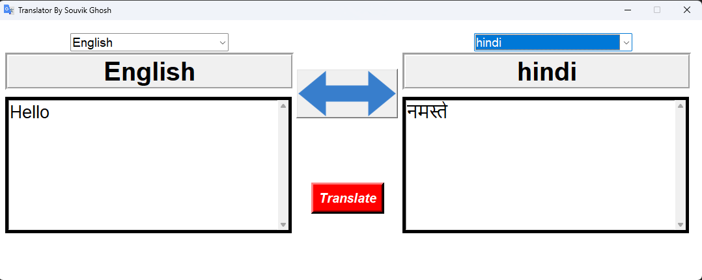

# GUI Translator  

A Python-based language translation application built with **Tkinter** and **Googletrans**. This tool allows users to seamlessly translate text between multiple languages through an intuitive graphical interface.  
## Preview  


## Features  
- **Two-Way Translation**: Swap between source and target languages effortlessly.  
- **Real-Time Updates**: Automatically update labels and translations.  
- **Wide Language Support**: Supports all languages available in the Googletrans library.  
- **User-Friendly Design**: Intuitive interface with input/output text boxes and language selectors.  
- **Internet Connection Check**: Alerts users if there’s no internet connection.  

## Requirements  
- Python 3.x  
- Required Libraries:  
  - `tkinter`  
  - `googletrans==3.1.0a0`  
  - `Pillow`  

Install dependencies:  
```bash  
pip install googletrans==3.1.0a0  
